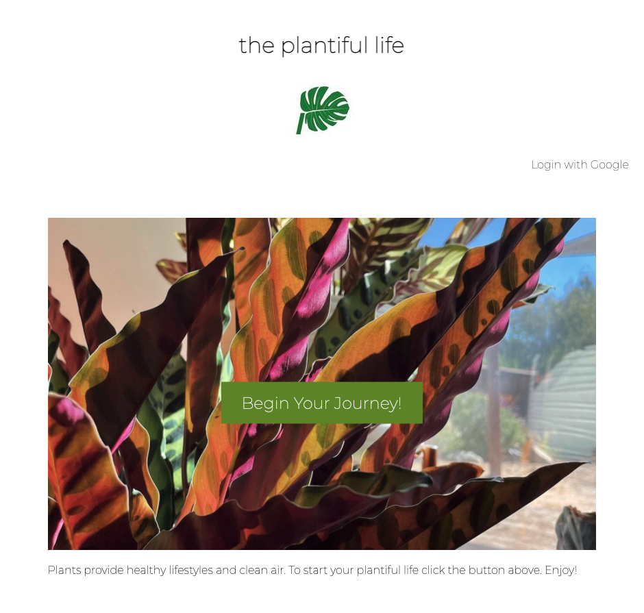

# App Title: The Plantiful Life

I am a Plantista. I want to help build a community with other Plantistas who share a common interest in plants. Like having a pet, plants helped many get through this pandemic, be it in health and wellness, having a companion, or having something to nourish and watch grow. 

The Plantiful Life is a full stack web application developed with a simple user friendly experience in mind. It is clean and lightweight with a primary focus on tracking your plant's growth and maintenance. You have the capability to add info about your plant in a list to store in one location, as well as track the date and time you watered and groomed your plant in a care log. You can also check out other Plantista's collections and care logs to compare with yours. 

**Technologies used:** 
1. Express
2. NodeJS
3. MongoDB
4. Mongoose
5. HTML
6. CSS
7. JavaScript
8. Sketch - for wireframe
9. Google API

## Getting Started 
[The Plantiful Life](https://the-plantiful-life.herokuapp.com/)

[Trello Planning](https://trello.com/invite/b/RUvHgZfg/8f24e3d5da6eba360f1f45f0d6b181b4/project-2-the-plantiful-life)

**Next Steps**

1. Comments, likes, favorites features 
2. Interactive visual meter to show growth progress
3. Plant Swap Local Events Listing
4. ID my plant

