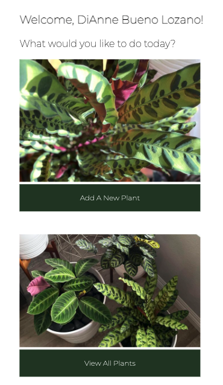

# App Title: The Plantiful Life

I am a Plantista. I want to help build a community with other Plantistas who share a common interest in plants. Like having a pet, plants helped many get through this pandemic, be it in health and wellness, having a companion, and having something to nourish and watch grow. 

The app is very simple to use so you can spend more time caring for our plant(s). You can add info about your plants to a list to store in one location ad, well as track the date and time you watered and groomed your plant in your own care log. You can also check out other Plantista's collections and care logs. 

**Technologies used:** 
1. Express
2. NodeJS
3. MongoDB
4. Mongoose
5. HTML
6. CSS
7. JavaScript
8. Sketch - for wireframe
9. Google API

## Getting Started 
[The Plantiful Life](the-plantiful-life.herokuapp.com)
[The Plantiful Life](https://trello.com/b/RUvHgZfg/project-2-the-plantiful-life)

**Next Steps**

1. Comments, likes, favorites features 
2. Interactive visual meter to show growth progress
3. Plant Swap Local Events Listing
4. ID my plant

